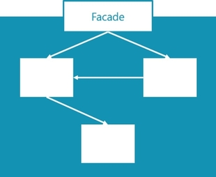

+++
title = "Facade Pattern"
weight = 1180
+++

_Created by Erich Gamma, Richard Helm, Ralph Johnson, John Vlissides (Gang of Four), Described by Jesper Schulz-Wedde (Microsoft)_

## Abstract

The intent of this pattern is to provide a unified API to a collection of potentially complex subsystems. If you apply this pattern as a general pattern, you'll implement:
- Decoupling
- Encapsulation
- Readability
- Testability
- Maintainability

## Context: 

Whenever you have to write an isolated piece of business logic, this pattern should be applicable.

## Problem: 

In AL, the facade pattern addresses two main problems:
- Over time as systems grow, they tend to become complex and harder to comprehend. By adding a facade on top of the subsystem, that complexity is hidden and a clear API is defined.
- Any object or method which is publicly accessible, may not receive breaking changes in future releases without announced deprecation. This complicates maintainability of the system. By adding a facade, you ensure that the subsystem is inaccessible to the outside systems, enabling you to change the implementation details of the subsystem at will.

## Description

The facade pattern is one of the most commonly used and known patterns, first described the book [Design Patterns: Elements of Reusable Object-Oriented Software](https://archive.org/details/designpatternsel00gamm/page/185). It is classified as a structural pattern. While it originates from the object-oriented world, it for sure also applies to AL. The power of a facade is that it:

- Improves the readability of your subsystem's API, as it acts as an entry point to your subsystem. This also allows for easier documentation of your API, as you can focus it to a few public objects.
- Improves the maintainability of your subsystem, as the internal subsystem can be modified or even completely replaced freely, without risking to break the public API - as long as the facade remains intact.
- Ensures that your code remains loosely coupled and encapsulated, as no other subsystem can take dependencies on your internal implementation details. This also fosters the reusability of your code.
- Suggests what needs most attention in your tests, as you would want to make sure that your subsystem's public API behaves as designed.

Whenever you develop a functional group or an independent system, which has a clear API, you should add a facade to achieve the above mentioned benefits.

### What is a subsystem?

A subsystem is a group of objects, which together provide a set of capabilities. Libraries are excellent examples of such subsystems.
In Business Central, all modules in the System Application are subsystems. Examples are hence every module you will find in the system application, such as:

- Azure Blob Services API
- Barcode
- Cryptography Management
- Encoding
- Image
- RegEx
- ...

If you can describe a set of capabilities out of context of the rest of the system, chances are you are looking at a subsystem.

### The Pattern

This is arguably one of easiest patterns to understand and implement. Loosely speaking, you simply need to smack a wrapper on top of your implementation and hide away your implementation details from the outside world.



To achieve this, we are using [access modifiers](https://docs.microsoft.com/bs-cyrl-ba/dynamics365/business-central/dev-itpro/developer/devenv-using-access-modifiers). Let's try to take a look at an example, taken from the system application: [the Image module](https://github.com/microsoft/ALAppExtensions/tree/main/Modules/System/Image). I'm using this very simplified example for illustration purposes. Notice, that even the full subsystem at time of writing isn't complex - it merely has a single codeunit containing the implementation details. However, as it is expected that the complexity will increase over time or that the implementation details can change, the subsystem is already equipped with a facade from the beginning.

*The Facade*

```AL
codeunit 3971 Image
{
    Access = Public;

    var
        ImageImpl: Codeunit "Image Impl.";

    /// <summary>
    /// Creates an image from the specified data stream.
    /// </summary>
    /// <param name="InStream">A Stream that contains the image data.</param>
    /// <error>Stream do not contain valid image data</error>
    procedure FromStream(InStream: InStream)
    begin
        ImageImpl.FromStream(InStream);
    end;

    /// <summary>
    /// Gets the width in pixels.
    /// </summary>
    /// <returns>The width in pixels.</returns>
    procedure GetWidth(): Integer
    begin
        exit(ImageImpl.GetWidth());
    end;
}
```

The facade codeunit above has some characteristics:
- Access is explicitly set to Public, to underline that this is a facade.
- All methods are public.
- All methods are documented.
- No methods contain any logic. They merely point to implementation details.
- The object naming suggests, that it will get referenced from the outside.

Anyone who wants to access the subsystem, will only have to take a dependency on the facade; the implementation details are not needed nor accessible.

Anyone who wants to access the subsystem, will only have to relate to this one public facade; the documentation makes it easy to understand the subsystem's capabilities.

Test of the subsystem can be limited to testing the facade - it is strictly speaking the only thing that needs verification, that it functions as designed. It is the contract of the subsystem.

*The Subsystem*

```AL
codeunit 3970 "Image Impl."
{
    Access = Internal;

    var
        TempBlob: Codeunit "Temp Blob";

    procedure FromStream(InStream: InStream)
    var
        OutStream: OutStream;
    begin
        TempBlob.CreateOutStream(OutStream);
        CopyStream(OutStream, InStream);
    end;

    procedure GetWidth(): Integer
    var
        Image: DotNet Image;
        InStream: InStream;
    begin
        TempBlob.CreateInStream(InStream);
        Image := Image.FromStream(InStream);
        exit(Image.Width());
    end;
}
```

There are no rules for the subsystem, except that access needs to be **internal**. How you implement, how much you document, how you test, is entirely up to you and not the business of the outside caller. Of course you should apply all of the best practices and patterns anyway, as you and possibly other developers will have to understand, extend and maintain the subsystem too. But from the view of this pattern, the complexity of the subsystem is irrelevant - just as long as it's not accessible.

## Usage: 
The facade pattern is one of the most prominent patterns in the [system application](https://github.com/microsoft/ALAppExtensions/tree/main/Modules/System). You will find plenty of examples here.

## Benefits:

The benefits of this rather simple pattern should be abundantly clear by now. But let's go over them once more, structured by the advantages this patterns brings:

### Decoupling
As the entire subsystem is inaccessible to outside systems, no dependencies can be taken. Hence this patterns strongly promotes the decoupling of objects.

### Encapsulation
The entire purpose of this very pattern is to encapsulate complexity; you hide away the implementation details behind an easy to understand facade.

### Readability
If done right, the developer doesn't need to be able to understand the details of the subsystem. Everything relevant to using the subsystem is described in the facade.

### Testability
Ensuring the correct behavior of the subsystem can be done by testing the facade. The facade defines the contract of your subsystem - what does it expose and how should it behave. That contract should be covered with adequate tests, which will ensure that it is upheld, even if you decide to change the implementation of the subsystem.

### Maintainability
The one thing you may not change freely, is the facade and the test of the facade. It can be extended, but you should not break any existing APIs. But that leaves the entire subsystem to be completely rewritten, if you desire to do so. As no external dependencies can exist, there is no risk of introducing any syntactical breaking changes to the outside world. And as the tests of the public facade remain, there is no risk of introducing semantical breaking changes either - the contract is upheld, as long as your tests pass.

## When not to use

This is a very applicable pattern, which can be used in most cases. While it may appear to be overkill at the beginning of the design of your subsystem, chances are your subsystem will evolve in complexity over time. The pattern may complicate implementation of extensibility, as you hide away all implementation details and hence also take away the opportunity to extend those, but that does not mean that extensibility cannot be achieved - but it requires more careful designing for extensibility. Extensibility with facades could be a topic of its own, which for now isn't covered by this pattern description. As always, use your common sense when to use and when not to use this pattern.

## Snippets

Given the simplicity of this pattern, there are no snippets available at the moment.

## List of references

This is one of the most commonly used and discussed, initially described here:

[Design Patterns: Elements of Reusable Object-Oriented Software](https://archive.org/details/designpatternsel00gamm/page/185). Addison Wesley. pp. 185ff. ISBN 0-201-63361-2.

It is also a key pattern in the design of our system application modules, which is described here:

[Module Architecture](https://docs.microsoft.com/en-us/dynamics365/business-central/dev-itpro/developer/devenv-blueprint)