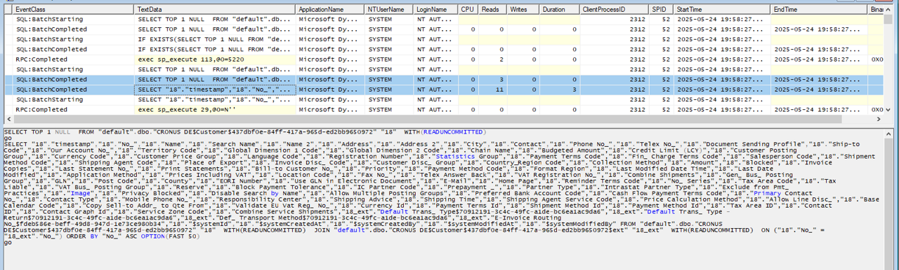
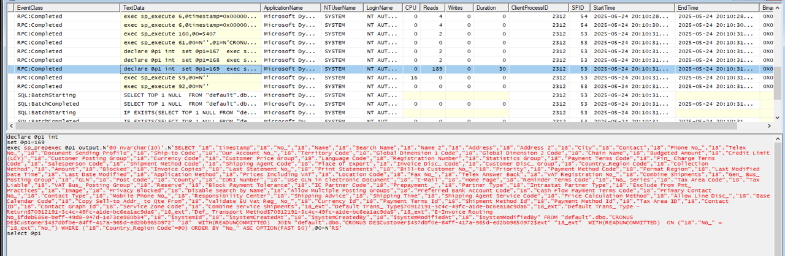
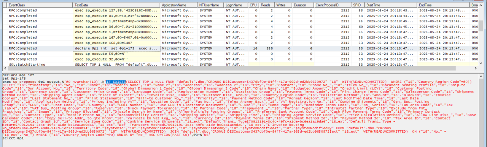
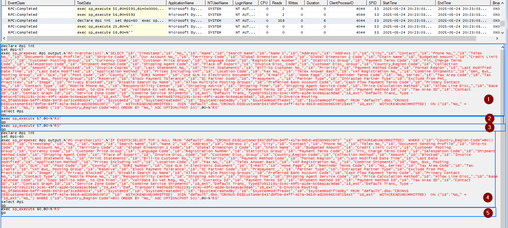

_Created by SosicStefan, Described by SosicStefan_

## Introduction

When retrieving records in Business Central, a common pattern is using `IsEmpty` before calling `FindSet` to check whether data exists. However, this approach is redundant and can lead to unnecessary database queries. Business Central’s runtime already optimizes `FindSet` to avoid unnecessary retrieval operations.

## Why Not Use 'If Not IsEmpty Then FindSet'?

The following pattern:

```al
if not Customer.IsEmpty() then
    Customer.FindSet();
```

This introduces inefficiencies due to:
- Redundant checks: Business Central internally wraps FindSet in an IF EXISTS query when repeated on platform level itself.
- Extra queries: Calling IsEmpty separately can lead to duplicate execution of SELECT TOP 1 NULL, slowing down performance.

## How Business Central Optimizes FindSet

Consider the following loop:

```al
internal procedure IsEmptyAndFindSet()
var
    Customer: Record Customer;
    i: Integer;
begin
    for i := 1 to 10 do begin
        Customer.SetRange("Country/Region Code", 'RS');
        if not Customer.IsEmpty() then
            Customer.FindSet();
    end;
end;
```

With this code being executed, Business Central will run two queries on SQL:
- One for checking `IsEmpty`
- Second for getting dataset with `FindSet`




## Best Practice: Use FindSet Directly

Instead of checking `IsEmpty` first, simply use only `FindSet`:
```al
internal procedure FindSetWithoutIsEmpty()
var
    Customer: Record Customer;
    i: Integer;
begin
    for i := 1 to 10 do begin
        Customer.SetRange("Country/Region Code", 'RS');
        if Customer.FindSet() then;
    end;
end;
```

Initially, Business Central runs a normal `SELECT` query to retrieve the data.



However, after running this query for three times, on fourth time the system switches to an optimized query:



After optimized query, the platform already applies the `IF EXISTS` logic dynamically. Means that explicitly calling `IsEmpty` before `FindSet` is unnecessary.

Full query execution looks like this:



## Summary
Avoid using if not `IsEmpty` then `FindSet`, as Business Central optimizes `FindSet` at the runtime level. This approach eliminates redundant queries, improves performance, and ensures cleaner code.
