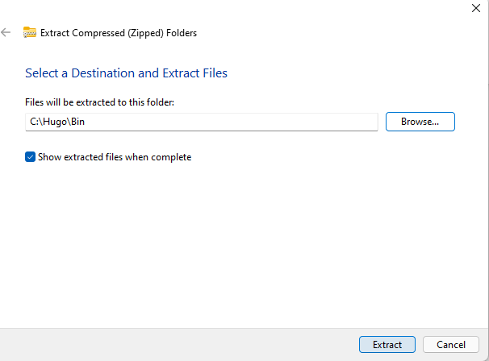

This guide will walk You thrugh installing Hugo on a Windows 11 PC. For the official install guide, You can wisit <https://gohugo.io/gettingstarted/installing/>.

## Download Binaries

The path of least resistance is to just download the .zip file from the official Hugo GitHub Repository [here](https://github.com/gohugoio/hugo/releases).

The theme that are used, needs the extended version of Hugo, so make sure to download the **extended** version by ensuring the file name starts with `hugo_extended...`

{}
For the purpose of this install guide, we are assuming You will want to follow the "standard" used by Hugo for installing. We will be creating a `Hugo` folder in the root of `C:\`. That folder will have a `Bin` folder for the binaries, and a `Sites` folder for each website You are building.

Once You are done, You should have a folder structure that looks like this:

```text
C:\Hugo
├── Bin            # Binaries
└┬─ Sites          # Hugo Site Repositories
 └── alguidelines  # Hugo Source for alguidelines.dev
```

{}


After downloading the .zip file, extract the zip-file to `c:\Hugo\Bin`




## Add Hugo to Path

After copying the binaries to Your PC, You will need to add Hugo binaries to the `%PATH%` system environment variables.

To do that, search for `environment`


once you see the `Edit the system environment variables`, open it and select `Environment Variables`


Once the Environment Variables screen is open, highlight the `Path` lines and press the `Edit...` button


Now press `New` and add the `C:\Hugo\Bin` to the path. Press `OK` and `OK` to save the new `Path`


Once complete. You should now be able to preview the Hugo site on <http://localhost:1313> by opening a command promt, and open the `C:\Hugo\Sites\alguidelines` folder and execute `Hugo Serve`

