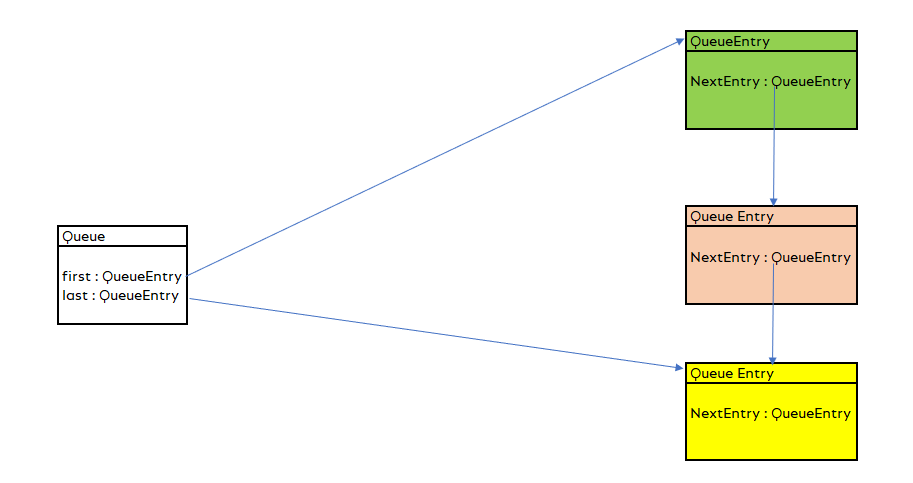

_Created by Patrick Schiefer, Described by Patrick Schiefer_

## Abstract
The goal of this pattern is to control the flow of multiple processes


## Problem
Sometimes its neccassary to perform multiple processes in Business Central, for example you want to post more than one order or before you post an Order you also have to post a purchase order this often leads to spaghetti code with big if else structures, which is not easy to read

## Description
The pattern is ideal for executing several independent processes in succession. Since the processes are independent, each process must take care of error handling itself. 
The pattern should not be used to control a single process.

## The Pattern
To structure this problem we can use the "Command Queue" pattern. The pattern consist of two main parts the queue and the command interface



First the command interface, it only has one procedure to execute the command
```al
interface ICommand
{
    procedure Execute();
}
```


And then the Queue which consist of two codeunits, the Queue itself and a Queue Entry

```al
codeunit 50100 "Queue"
{
    procedure Push(var value: Interface ICommand)
    var
        Entry: Codeunit QueueEntry;
    begin
        Entry.SetValue(value);
        if count = 0 then begin
            first := Entry;
            last := Entry;
        end
        else begin
            last.SetNextEntry(Entry);
            last := Entry;
        end;
        count += 1;
    end;

    procedure Pop() value: Interface ICommand;
    begin
        if count > 0 then begin
            value := first.GetValue();
            first := first.GetNextEntry();
            count -= 1;
        end
        else
            Error('The Queue is empty!');
    end;

    procedure GetSize(): Integer
    begin
        exit(count);
    end;

    var
        first: Codeunit QueueEntry;
        last: Codeunit QueueEntry;
        count: Integer;
}


codeunit 50102 "QueueEntry"
{
    procedure SetValue(var v: Interface ICommand);
    begin
        value := v;
    end;

    procedure GetValue(): Interface ICommand;
    begin
        exit(value);
    end;

    procedure GetNextEntry(): Codeunit QueueEntry;
    begin
        exit(NextEntry);
    end;

    procedure SetNextEntry(var Entry: Codeunit QueueEntry);
    begin
        NextEntry := Entry;
    end;

    var
        value: Interface ICommand;
        NextEntry: Codeunit QueueEntry;
}
```

As we see the queue entry stores a command, since the command is an interface we can hide each business logic behind

## Benefits
The logical flow is very easy to adopt, it is even possible to add entries to the queue while it is processed.

## Example

In this short example I show you how to post multiple sales orders and display message after finishing the last post.


We have two commands in this example, the "SalesOrderPostCommander" is used to post a sales order and the "MessageCommander" displays a message.
```al
codeunit 50104 "SalesOrderPostCommander" implements ICommand
{
   procedure SetSalesOrderNumber(value : Code[20])
   begin
     No := value;
   end;
   
   procedure Execute()
   begin
     // TODO Post Sales Header
   end;
   

   var 
     No : Code[20];
}


codeunit 50103 "MessageCommander" implements ICommand
{
    procedure SetText(value: Text);
    begin
        t := value;
    end;

    procedure Execute()
    begin
        Message(t);
    end;

    var
        t: Text;
}
```

Using this two codeunits we can now implement a patch posting
```al

codeunit 50105 PatchPostQueue
{
   procedure PatchPost()
   begin
     FilterSalesOrdersToPost();
     if not SalesOrders.Findset(false) then
       exit(); // Nothing to post
     
     repeat
       AddSalesOrderToQueue(SalesOrder."No.");
     until SalesOrders.Next() = 0;

     AddMessageToQueue('Posting Complete');
     ExecuteQueue();
   end;

   local procedure ExecuteQueue()
   var
     object : interface "ICommand";
   begin
     repeat 
       object := queue.Pop();
       object.Execute();
     until queue.GetSize() = 0;
   end;

   local procedure FilterSalesOrdersToPost()
   begin
      // Filter Sales Orders here
   end;
   
   local procedure AddMessageToQueue(message : Text);
   var 
     t: Codeunit MessageCommander;
     object: Interface ICommand;
   begin
     t.SetText(message);
     object := t;
     queue.Push(object);
   end;

   local procedure AddSalesOrderToQueue(No : Text);
   var 
     SaleOrderCommander: Codeunit SalesOrderPostCommander;
     object: Interface ICommand;
   begin
     SaleOrderCommander.SetSalesOrderNumber(No);
     object := SaleOrderCommander;
     queue.Push(object);
   end;
   

   var
     SalesOrders : Record "Sales Header";
     queue: Codeunit Queue;
}

```


## References 
[Detailed Explanation of the pattern](https://patrickschiefer.wordpress.com/2022/02/24/part-2-how-to-implement-a-command-queue-in-pure-al/)

